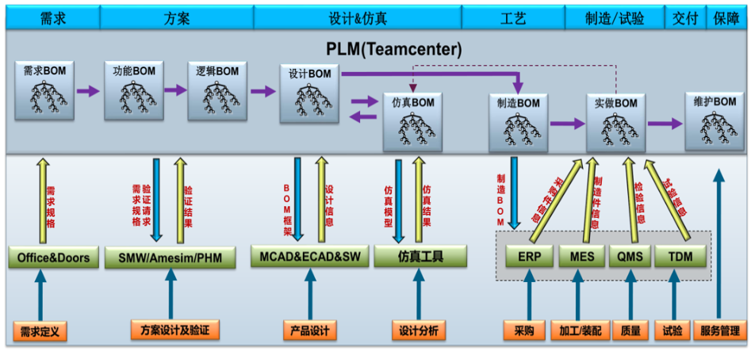

# BOM

BOM作为企业进行设计、加工、管理的核心，不同的部门有不同的要求。例如，生产部门只需要描述自制件信息的制造 BOM，工艺部门只需要工艺 BOM，物资部门只需要原材料和标准件的采购 BOM。设计部门应提供涵盖以上各种BOM 的设计 BOM。故根据不同部门、不同角色、不同维度需要不同的BOM视图。

在产品的整个生命周期中，根据不同部门对 BOM的不同需求，主要存在以下几种 BOM：工程物料清单 EBOM、PBOM、MBOM、CBOM等。

## BOM

别名：物料清单，Bill of Material

物料清单也称产品结构表、物料表，如当前系统部件的结构列表、导出的结构清单示例。它是产品结构的关系描述，将产品的原材料、零配件、组装件等予以拆解，并将各单项物料如物料编码、名称、规格、单位、工位、序号、损耗等按照制造流程的顺序记录下来，排列成一个清单，即形成物料清单。狭义上指产品结构，广义上需要产品结构与工艺流程等作为结合体，也可扩展到资源层面，形成全面的BOM。

## EBOM

别名：工程BOM，Engineering BOM，设计BOM

主要是设计部门产生的数据。产品工程设计管理中使用的数据结构，它通常精确地描述了产品的设计指标和零件与零件之间的设计关系。对应文件形式主要有产品明细表、图样目录、材料定额明细表、产品各种分类明细表等。

## PBOM

别名：计划BOM，Plan BOM，工艺BOM

主要是工艺部门根据工厂的加工水平和能力，对EBOM中的数据为依据，制定工艺计划、工序信息、生成计划BOM的数据。它用于工艺设计和生产制造管理，使用它可以明确地了解零件与零件之间的制造关系，跟踪零件是如何制造出来的，在哪里制造、由谁制造、用什么制造等信息。同时，PBOM也是ERP生产管理的关键管理数据结构之一。

## MBOM

别名：制造BOM，Manufacturing BOM，生产BOM，装配BOM

是生产制造部门根据EBOM或PBOM的数据基础上，对设计和工艺装配步骤进行详细设计后得到的，主要描述了产品的装配顺序、工时定额、材料定额，以及相关设备、刀具、卡具和模具等工装信息，反映了零件、装配件和最终产品的制造方法和装配顺序，反映物料在生产车间之间合理流动和消失过程，也是ERP生产管理的关键管理数据结构之一。

## CBOM

别名：成本BOM，Costing BOM

是财务部门根据设计部门、工艺部门、制造部门的数据信息进行汇总核算形成的财务报表。成本CBOM给出了成本信息，包括采购成本、制造成本、总采购成本、总制造费用以及分摊管理费用。它用于制造成本控制和成本差异的分析。

## EBOM和PBOM的区别

数据来源不同。EBOM数据来源于CAD软件系统，PBOM则主要是对产品工艺实施规划的过程以及制造过程的反映产品属性的一种生成计划文件，一般来源CAPP系统。

## EBOM和MBOM的区别

* 组成不尽相同。MBOM是设计和工艺的综合，除常规的产品结构物料外，还有相关的消耗品（如毛坯、用剂）和加工工具（夹具、刀具、量具），而出现在EBOM的物料也不一定出现在MBOM，如在EBOM中虚拟件通常不会出现在MBOM中。
* 反映内容侧重点不同。都反映产品结构，但EBOM重点反映产品的组成，MBOM除了反映产品的组成，还包括产品的制造层次和制造过程。
* 作业不同。MBOM是管理文件，EBOM纯粹是技术文件。
* MBOM包含的信息更多。

## 设计表更

以EBOM到PBOM再到MBOM视图变化为例，设计更改是设计部门对原设计（MCAD装配结构数据）的修改引起的EBOM产品结构的基础数据对象更改，而这个设计更改会对PBOM和MBOM的结构都产生影响，即随着EBOM的更改直接导致PBOM、MBOM的更改，因为产品基础视图的底层设计数据发生了变化。

## 工艺变更

以EBOM到PBOM再到MBOM视图变化为例，工艺变更一般是对不合理的工艺进行改进，改变工艺的路线、工序的信息、工艺的计划，并不不涉及产品视图结构基础设计数据的更改，所以工艺更改一般只对PBOM、MBOM产生影响。

