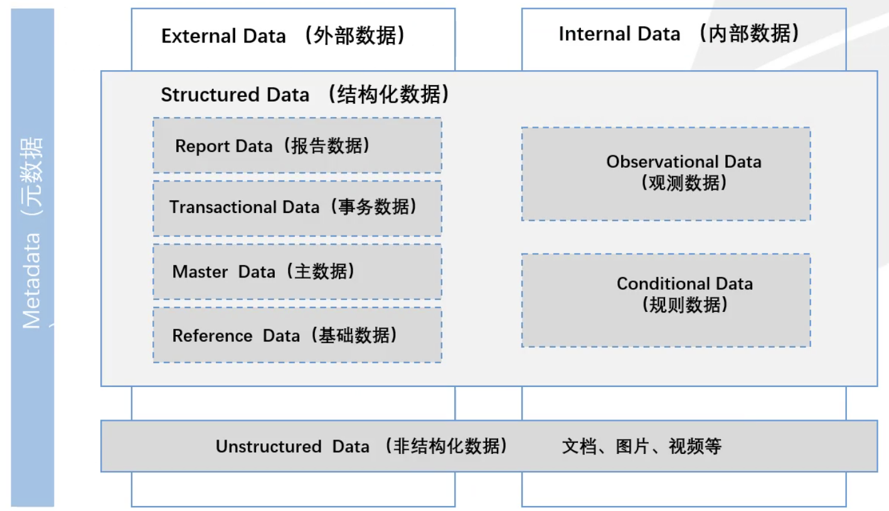
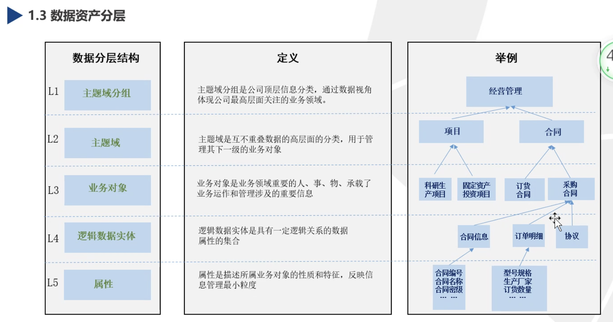
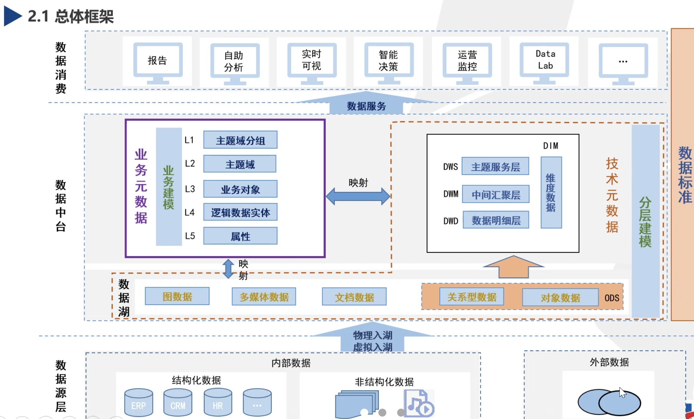
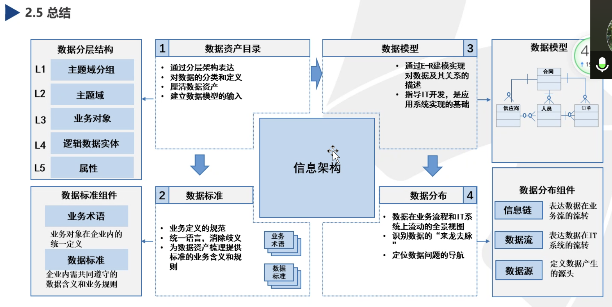

## 结构化数据

### 基础数据 Reference Data

用结构化的语言描述属性、用于分类或目录整编的数据，也称作参考数据，如合同类型、职位、国家、币种。

### 主数据 Master Data

具有高业务价值的、可以在企业内跨流程跨系统被重复使用，具有唯一、准确、权威的数据源，如实体性组织、客户、人员基础配置。

### 事务数据 Transactional Data

用于记录企业经营过程中产生的业务时间，其实质是主数据之前活动产生的数据，如BOQ、支付指令、主生产计划。

### 观测数据 Observational Data

观测者通过观测工具获取观测对象行为/过程的记录数据，如设备采集数据、环境采集数据、系统日志等。

### 报告数据 Report Data

指对数据进行处理加工后，用作业务决策依据的诗句，如收入、成本。

## 外部数据 External Data

通过公共领域获取的数据，客观存在，新增、修改不受我司的影响，比如国家等。

## 内部数据 Internal Data

企业内经营产生的数据，在企业的业务流程中产生或在业务管理规定中定义，受企业经营影响，比如合同、项目、组织。

## 非结构化数据 Unstructured Data

形式不固定，不方便使用数据库二位逻辑表来展示的数据，数据量较大，比如网页、图片、视频、音频、XML。

## 数据资产分层

## 总体框架

