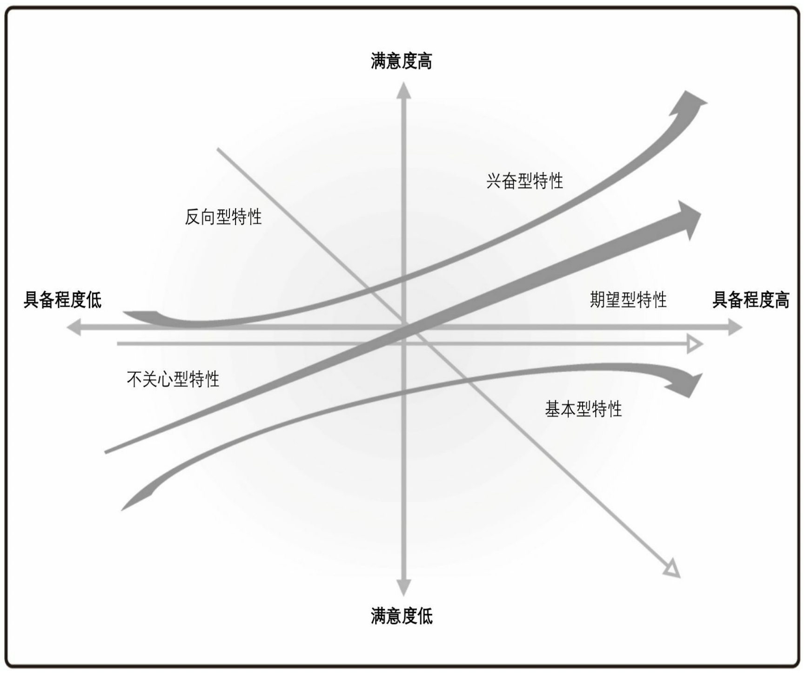

# 卡诺分析

卡诺分析是一种从客户视角考虑产品特性的技术，用来对产品特性进行建模和分析。

卡诺模型中有五种常见的产品特性类别。

* 基本型。对相关方仅提供满意度较低的特性。但是，当最终解决方案缺失特性时，会引起极度不满。相关方不会对这一类别的特性给予太多的考虑，因为他们已假设这些特性将包含在最终解决方案里。
* 期望型。相关方考虑的、期望的并用来评估最终解决方案的特性。这些特性可以使相关方满意或不满意，这取决于解决方案在多大程度上能实现此类特性。
* 兴奋型。产品区别于竞争者产品的特性，有时被称为“哇”因素。愉悦源自感情因素。当这些特性存在时，相关方极度满意。当这些特性不存在时，通常，相关方甚至没有意识到该功能是可能的，并且不会对此感到不满意。
* 不关心型。既不会使客户满意也不会令其不满意的特性。客户不关心是否包含这些特性。
* 反向型。当最终产品不包含这些特性时，相关方的满意度会增加。当最终产品呈现或增加这些特性时，相关方的满意度会降低。

