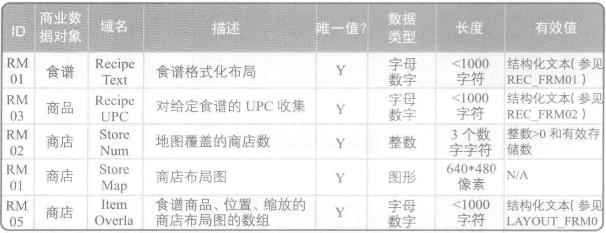

# 数据字典

类别：数据模型

数据域是[实体关系图](实体关系图.md)中数据对象的补充细节。

数据字典是罗列数据对象的数据域及其属性的一种数据模型。数据域的属性详述了域的信息，常见的属性包括名称、描述、大小、验证规则和商业规则。

数据字典用于明确数据非常详细的方面，并从商业干系人的视角获取数据域和属性。获取的信息不需要清晰地反映数据库设计。但是，数据库设计者使用数据字典作为输入来创建数据库结构。

数据字典通常在使用其他数据模型识别数据对象之后，并且在数据对象需要指定更多细节时创建。

