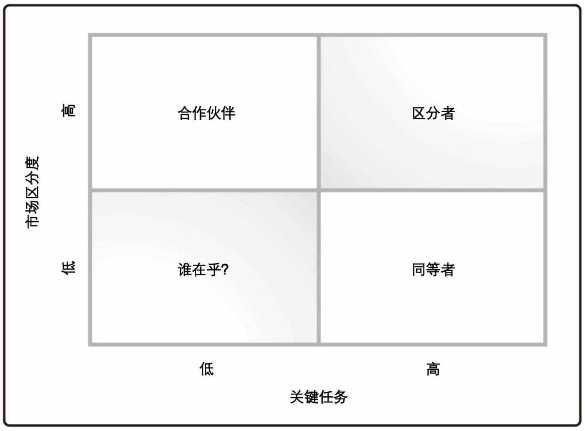

# 目的对准模型

目的对准模型提供了支持战略或产品决策的框架。该框架用于将选项与它所支持的商业目的进行对齐，从而对选项进行分类。

* 区分者。这类特性是关键任务，并且提供高度的市场差异化。它们可以帮助组织赢得市场份额，提高其竞争优势，并且超越其竞争对手。组织需要不断地在这一领域进行投资，以取得突破，提供独特性，并且在竞争中保持领先。
* 同等者。此类特性帮助组织保持其在市场上的同等地位。对同等特性的投资可能是关键任务，但它们不能为组织提供竞争优势。这类特性只是确保组织的业务与竞争对手保持同等水平。
* 合作伙伴。此类特性并不是关键任务，但如果提供了这些特性，它们将使组织能够在市场上脱颖而出。因此，组织将从外部寻找合作伙伴来提供这些特性，但不会对这些特性进行投资。通过提供这些特性而有所区分的组织是一个可行的合作伙伴。
* 谁在乎。这类特性对组织既没有区分也不是关键任务。这类特性通常不会被构建。

