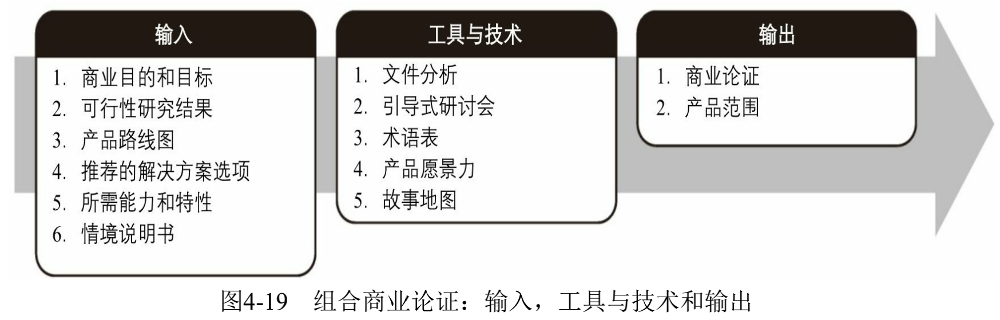

## 情景说明书 Situation Statement

* 问题（或机会）是“a”

* 具有的效果是“b”

* 产生的影响是“c”

## 商业分析计划

* 了解项目环境

## 商业分析工作计划

* 确定任务和活动
* 识别资源
* 确定角色和职责

## 商业计划

## 商业论证

商业论证提供了文档化的经济可行性研究报告，从价值的角度确立了由项目组合组件、项目集或项目所交付的效益的有效性。商业论证是商业目的和目标与为执行商业策略而建立的项目组合组件、项目集合项目间的公共链接。

## 项目章程 Project Charter

由项目启动者或发起人发布，正式批准项目成立，并授权项目经理使用组织资源开展项目活动的文件。

* 描述和目标
* 商业目的/目标
* 高层级产品和项目组合、项目集或项目的范围
* 风险
* 里程碑进度计划概要
* 预算概要信息
* 高层级风险和依赖性
* 成功标准
* 与项目组合、项目集或项目有关的内部和外部信息

