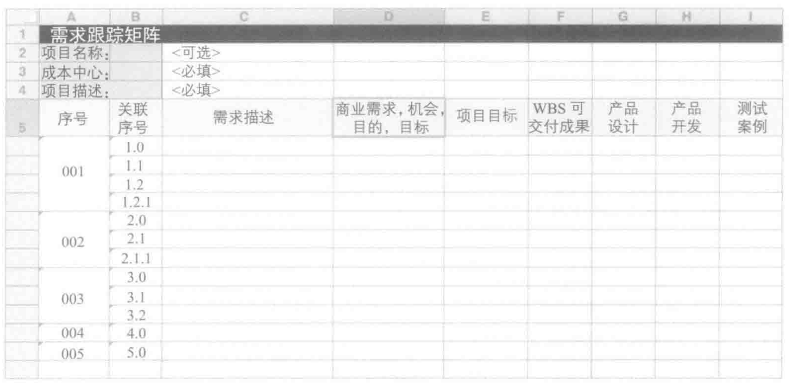

# 跟踪矩阵

跟踪矩阵是将产品需求的最初来源与满足需求的可交付成果关联起来的表格。它能支持许多不同种类的对象之间的关联，并且提供在项目和产品生命周期间跟踪产品信息的机制。

跟踪矩阵可以用来建立产品信息、可交付成果和项目工作间的关系，从而确保它们能追溯到商业目标。建立的这些联系可以通过只把相关的产品信息包含在解决方案中来管理范围蔓延。

## 需求跟踪矩阵属性

需求跟踪矩阵使用的典型属性包括

* 需求编号，用于各项需求的唯一识别属性。
* 需求的简短文字描述。
* 目标
  * 商业需求
  * 商业目的和目标
  * 项目目标

* 产品开发阶段
  * 设计
  * 构建
  * 测试
  * 实施
  * 验证
* WBS
* 状态：如已激活、已批准、已延期、已取消、已增加
* 列入的理由
* 优先级
* 负责人
* 来源
* 版本
* 完成日期
* 干系人满意度
* 稳定性
* 复杂性
* 验收标准

## 层级

跟踪矩阵通常按层级建立，从高层级需求开始，随着需求渐进明细，填入越来越多的细节。

## 变形

### 交互矩阵

对于使用适应型生命周期的项目，产品团队可以选择开发交互矩阵。

交互矩阵是跟踪矩阵的轻量级版本，可以用来决定需求是否已有足够的细节或仍有缺失的实体。

交互矩阵是暂时的，代表了一个即时快照。交互矩阵无须维护，仅用于在项目期间的任何给定时间对需求进行评价。

跟踪矩阵一般会保持在整个项目组合、项目集或项目中。