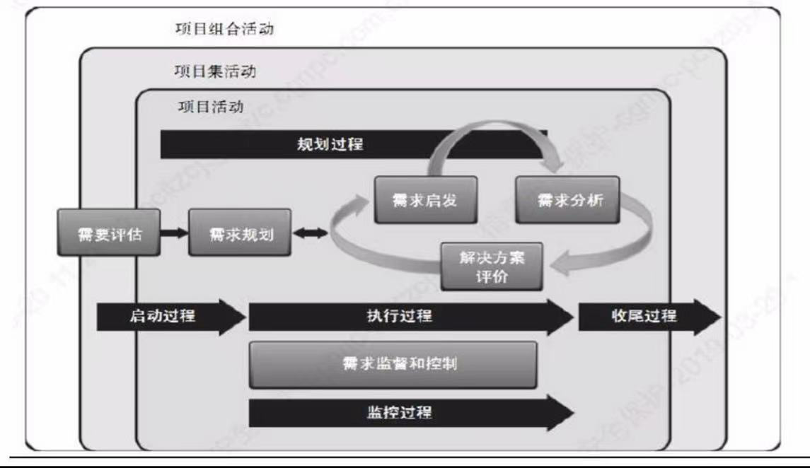

# 需求分析

flowchart LR

​	A[Business Problem (BP) / Business Opportunity (BO)]-->B[Business Need (BN)]

​	B[Business Need (BN)]-->C[Business Request (BR)]

​	C[Business Request (BR)]-->D[Decision Analysis and Resolution (DAR)]

end

## 商业需要Business Need

* 描述了组织或客户的问题，或市场机会。
* 商业需要是基于现有的问题或机会，推动组织变化的动力。它对为什么要提出组织变更，以及为什么要考虑新的项目组合组件、项目集或项目提供了理由。

## 商业目标

商业需求和所有其他类别产品需求的基础。

商业目的和目标描述了组织所要寻求实现的未来状态。

**目的**包含多个**目标**。目的较宏观且时间跨度较长，目标较具体且时间跨度较短。

## 商业分析Business Analysis

* 商业分析是识别商业需求，推荐相关解决方案，并启发文档化和管理需求的一系列活动集合。
* 可测量的、合理的商业目标。
* 商业分析的重点是通过开发非功能需求确保产品具有足够高的质量。