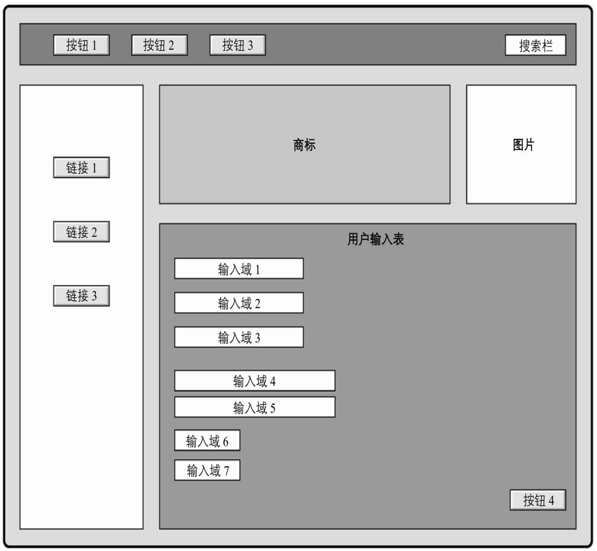
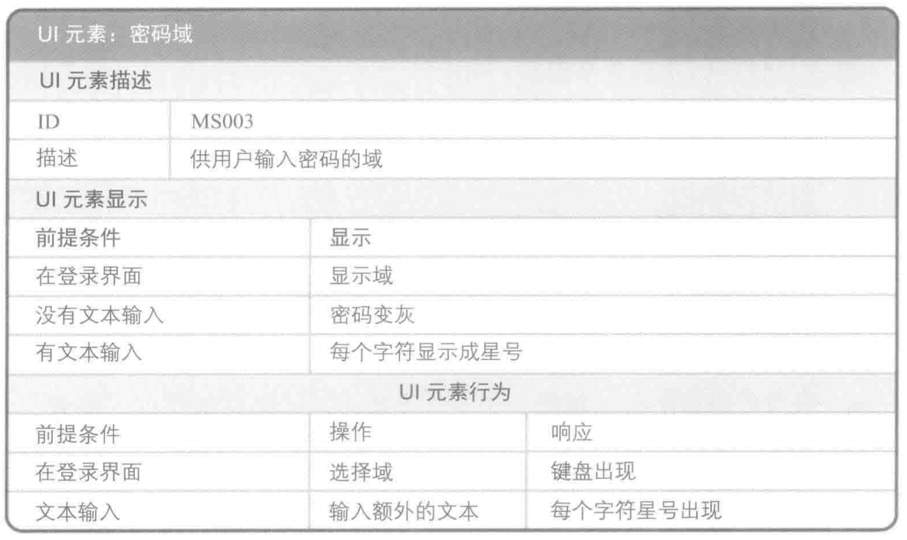

# 原型、线框图和显示-操作-响应模型

## 原型

在构建预期解决方案之前的表示法，可分为低保真原型和高保真原型。屏幕布局草图是低保真原型，交互式用户界面是高保真原型。

### 线框图

线框图是原型的一种，专用于模拟用户界面设计，也用于呈现屏幕外观。线框图可以是低保真的，如草图；也可以是高保真的，如能真实呈现最终用户界面外观样式。

## 显示-操作-响应模型

显示-操作-响应模型采用扁平化的格式来描述页面元素及赋予每个元素的功能，通常与原型或线框图结合使用，以连接用户界面元素需求和可视化的呈现方式。

有助于明确用户界面需求，把个性化需求说明置于屏幕界面上元素的上下文中。

通常在功能需求或验收标准得到明确后创建。

