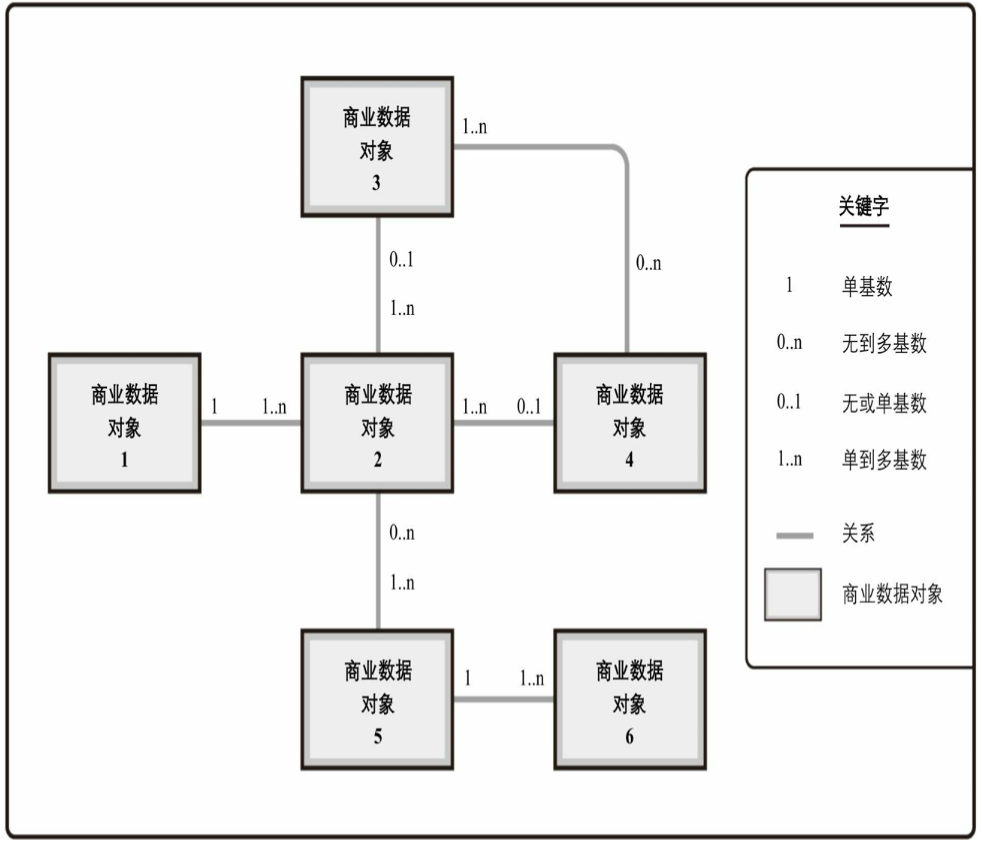

# 实体关系图

类别：数据模型

实体关系图（ERD）/商业数据图，是一种显示产品中的商业数据对象或感兴趣的信息片段，以及这些对象之间的基数关系的数据模型。基数是指一个实体和其他实体发生关系的次数，以及这种关系是否必需或可选。

在实体关系图中显示的数据对象不是数据库中确切的数据对象，而是从商业角度得到解决方案中数据的概念视图。实体关系图有助于识别在系统中创建、被系统使用或从系统输出的数据。

