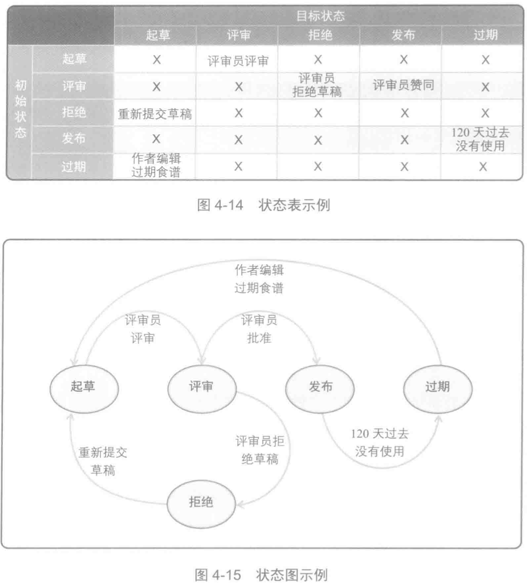

# 状态表/状态图

类别：数据模型

状态图和状态表都是用于显示对象的有效状态并允许在它们之间进行过渡的数据模型。对象可以是在分析解决方案时的山页数据条目或任何感兴趣的信息。

这两种模型都描述了单个对象在一个解决方案中所具有的所有状态，以及该对象在状态之间如何过渡

有助于发现与对象状态流转相关的商业规则。

帮助商务分析师明确解决方案中一个对象的生命周期。例如工作流的对象（如审批过程）就是用状态模型来帮助分析的。

状态表最常用来进行分析，已确保涵盖所有的过渡，而状态图更便于让相关方以可视化的方式看到有效的过渡流。

