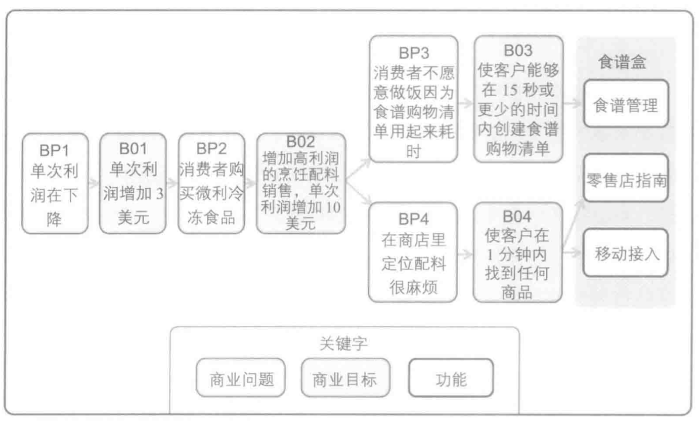

# 目的模型和商业目标模型

类别：范围模型

目的模型和商业目标模型都是组织并反映与其他产品信息有关的目的、商业目标、成功衡量标准和高层级功能的范围模型。

商业问题和商业目标的过程链方便呈现项目价值的来源。不论价值是否确认为增加收入、降低成本、或避免损失，目的模型和商业目标模型都可视化地表示支持功能优先级决策和产品范围管理的价值。

目的模型和商业目标模型提供了明确商业需求的结构。每个项目功能性需求应可追溯到所确认的商业问题和目标，保持专注于顶层商业问题和商业目标，可以引导交付有价值的解决方案并形成功能的范围。需求或功能的价值能被量化，都是基于模型中的需求如何为商业目标做贡献，这有助于确定最重要的功能来实现或确定最小可售功能（MMFs）。

