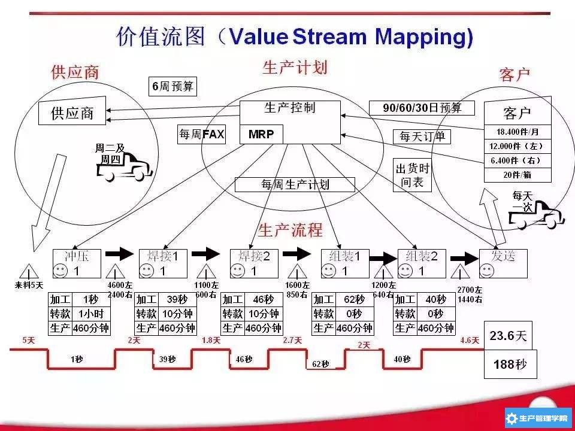

# 过程流

别名：泳道图，过程图，进程图，过程流程图，系统流

类别：过程模型

过程流可视化地描述人们在他们工作中执行的任务。通常情况下，过程流描述了人们采取的步骤。

在过程流中，方形表示步骤，菱形表示决策逻辑，箭头表示过程顺序。

过程流可能包含泳道，泳道是由同一个人、同一群人或同一系统实施的一组步骤。

## 变体

### 价值流图

除传统过程流所包含的信息以外，价值流图还显示了过程中发生的任何延迟、排队或切换。目的是识别过程中花费的非增值时间以简化流程。

### 活动图

可用来对一般工作流建模，但通常会用来以可视化的方式显示用例的复杂流。活动图通常在一个图中显示用户与系统的交互，并且体现了用例的文字描述。

### 序列图

序列图用于描述用户或系统过程如何在任何涉及的用户或系统中相互作用，以及对执行的过程或步骤进行排序。序列图对于与技术团队沟通系统间的信息流动、将功能委派到它将要执行的地方，以及步骤间的控制流都是非常有用的。在通过显示信息的流向来确定需要哪些商业对象时，序列图尤其有用。

